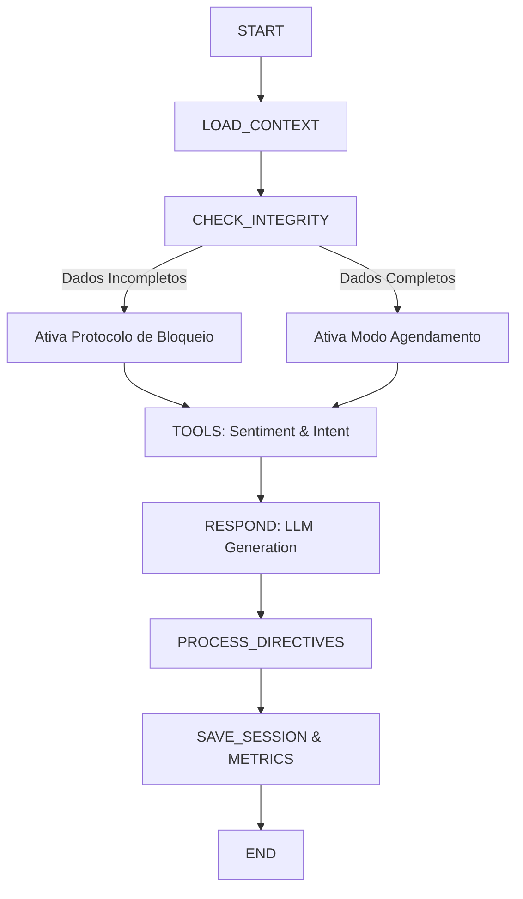

# 📅 Bot Agendador Inteligente Multi-Nicho (V2)

Microsserviço de agendamento baseado em LangGraph com arquitetura Zero-Write, barreiras de integridade cadastral e personalização profunda por tenant.

O sistema opera como uma Máquina de Estados Finitos (FSM) projetada para converter leads em agendamentos confirmados, respeitando regras de negócio rígidas (Hard Rules) e adaptando a "persona" do bot através de 15 dimensões configuráveis.

---

## 🏢 Visão Geral da Arquitetura

## **LangGraph & FSM**

O fluxo de conversação não é linear. Ele é governado por um grafo de estados que impõe barreiras lógicas:

* **Barreira de Integridade:** Impede agendamento se o cliente não tiver Nome/E-mail.
* **Barreira de Disponibilidade:** Impede alucinação de horários (usa apenas slots fornecidos).
* **Barreira de Retenção:** Impede cancelamento imediato (obriga tentativa de reagendamento).

---

## 🎯 Funcionalidades Principais

### **1. Personalização Profunda (15 Dimensões)**

Cada empresa (**tenant**) configura o comportamento do bot. O System Prompt é reconstruído dinamicamente a cada mensagem baseando-se em:

* **Identidade:** Nome do Bot, Nicho (Saúde, Estética, Jurídico).
* **Tom de Voz:** Profissional, Empático, Energético, Formal.
* **Protocolos:** Uso de Emojis, Extensão da Resposta, Gírias.
* **Negócio:** Foco da Conversa, Estilo de Persuasão.

---

### **2. Barreira de Cadastro Inteligente**

O nó **check_integrity** atua como um porteiro.

* Se `cliente.nome` ou `cliente.email` forem **nulos**, o bot entra no **Modo de Bloqueio**.
* Ignora solicitações de agendamento.
* Solicita **Nome e E-mail na mesma interação**.

---

### **3. Gestão de Status (Kanban Automático)**

O bot classifica o lead em:

* **Novo Lead**
* **Em Atendimento**
* **Agendado**
* **Reagendamento**
* **Handoff Humano**
* **Cancelado**

---

### **4. Métricas de Auditoria**

Registra consumo de tokens por `company_id`.

---

## 🔄 Fluxo de Execução (O Grafo)



---

## 🛠️ Instalação e Configuração

### **Pré-requisitos**

* Python **3.10+**
* MongoDB **5.0+**
* OpenAI API Key (**GPT-4o recomendado**)

---

### **1. Setup do Ambiente**

```bash
# Clone o repositório
git clone <url-do-repo>
cd bot-agendamento

# Configure as variáveis de ambiente
cp .env.example .env

# Instale dependências
python -m venv venv
source venv/bin/activate  # Linux/Mac
# venv\Scripts\activate   # Windows
pip install -r requirements.txt
```

---

### **2. Configuração do Vector Search (RAG)**

Crie o índice no MongoDB Atlas:

```json
{
  "name": "knowledge_vector_index",
  "definition": {
    "mappings": {
      "dynamic": true,
      "fields": {
        "embedding": {
          "dimensions": 512,
          "similarity": "cosine",
          "type": "knnVector"
        },
        "company_id": {
          "type": "token"
        },
        "is_active": {
          "type": "boolean"
        }
      }
    }
  }
}
```

---

### **3. Execução**

```bash
./run.sh
# ou
python -m uvicorn app.main:app --host 0.0.0.0 --port 8000 --reload
```

---

## 📡 Documentação da API

### **Endpoint Principal: `POST /chat`**

#### **Request Payload**

```json
{
  "session_id": "5521999887766",
  "company": {
    "id": "clinica_vida_nova",
    "nome": "Clínica Vida Nova",
    "equipe": [
      {
        "id": "prof_maria",
        "nome": "Dra. Maria",
        "servicos": [
          {"id": "srv_consulta", "nome": "Consulta Geral", "duracao_min": 30, "preco": 200.0}
        ],
        "agenda_disponivel": [
          {
            "data": "2023-11-01",
            "slots": [
              {"hora": "09:00", "disponivel": true},
              {"hora": "14:00", "disponivel": true}
            ]
          }
        ]
      }
    ],
    "config_override": null
  },
  "cliente": {
    "telefone": "5521999887766",
    "nome": null,
    "email": null,
    "mensagem": "Bom dia, quero marcar horário"
  }
}
```

---

#### **Response Payload**

```json
{
  "cliente_id": "5521999887766",
  "company_id": "clinica_vida_nova",
  "response_text": "Bom dia! Bem-vindo à Clínica Vida Nova. Antes de vermos os horários da Dra. Maria, poderia me informar seu nome completo e e-mail para cadastro?",
  "kanban_status": "Novo Lead",
  "directives": {
    "type": "normal",
    "payload_update": null,
    "payload_appointment": null
  },
  "cost_info": {
    "total_tokens": 520,
    "input_tokens": 480,
    "output_tokens": 40
  },
  "metadata": {
    "intent": "SCHEDULING",
    "sentiment": "POSITIVO"
  }
}
```

---

### **Endpoint de Métricas: `GET /metrics/{company_id}/usage`**

```json
{
  "company_id": "clinica_vida_nova",
  "period": "daily",
  "data": [
    {
      "period": "2023-11-01",
      "interactions": 12,
      "tokens": {
        "input": 5400,
        "output": 800,
        "total": 6200
      }
    }
  ]
}
```

---

## 🧠 Lógica de Negócio (Hard Rules)

### **1. Protocolo de Oferta ("Ou/Ou")**

Nunca perguntar:

> “Quando você quer vir?”

Correto:

> “Tenho horário na Terça às 09h **ou** Quinta às 14h. Qual prefere?”

---

### **2. Protocolo Anti-Cancelamento (Retenção)**

1. Primeira tentativa → Oferece reagendamento
2. Segunda tentativa → Cancela

---

### **3. Preenchimento de Diretivas**

* `update_user` → quando o cliente fornece Nome/E-mail.
* `appointment_confirmation` → quando cliente confirma horário+serviço+profissional.

---

## 🗂️ Estrutura do Projeto

```
scheduling-bot/
├── app/
│   ├── main.py
│   ├── config.py
│   ├── models/
│   │   ├── agent.py
│   │   ├── chat.py
│   │   ├── company.py
│   │   ├── customer.py
│   │   └── usage.py
│   ├── services/
│   │   ├── usage_service.py
│   │   ├── session_service.py
│   │   ├── rag_service.py
│   │   └── openai_service.py
│   ├── tools/
│   │   ├── intent_tool.py
│   │   └── sentiment_tool.py
│   └── agent/
│       ├── graph.py
│       ├── state.py
│       ├── prompts.py
│       └── nodes/
│           ├── check_integrity.py
│           ├── load_context.py
│           ├── respond.py
│           ├── process_directives.py
│           └── save.py
├── requirements.txt
├── .env.example
└── run.sh
```


